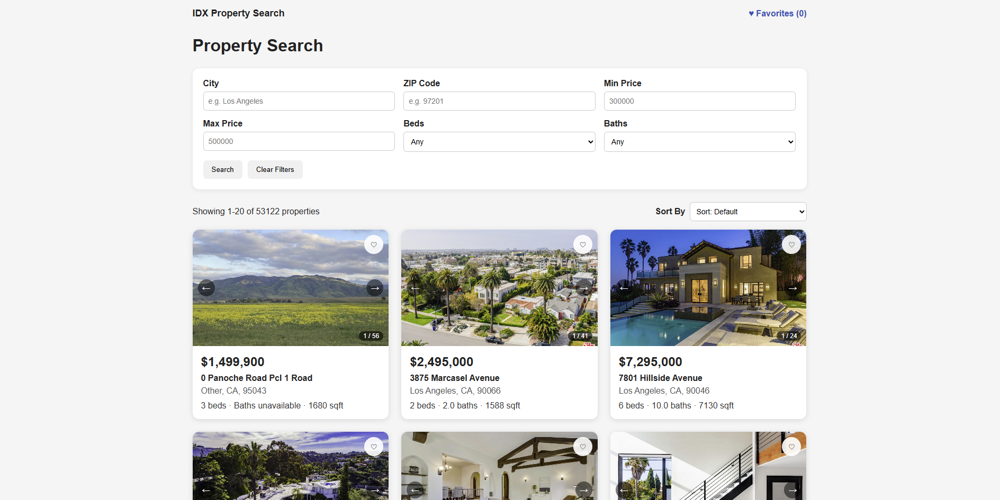

# IDX Property Search

A Zillow/Redfin-style property search application backed by real MLS data: a searchable, filterable, sortable listings page with pagination; a property detail page with a photo gallery, map, and open house schedule; favorites; and a REST API in front of a MySQL database of ~53,000 property listings.





## Tech Stack

| Layer | Technology | Version |
|---|---|---|
| Frontend | React (Create React App) | 19.2.8 |
| Routing | React Router | 6.30.6 |
| Backend | Node.js + Express | 5.2.1 |
| Database | MySQL (Docker) | 8 |
| DB driver | mysql2 | 3.22.5 |
| Testing (backend) | Jest + Supertest | 30.5.1 / 7.2.2 |
| Testing (frontend) | Jest (via react-scripts) + React Testing Library | 16.3.2 |
| Maps | Google Maps Embed API | — |

**Data flow:** React (port 3000) → Express API (port 5000) → MySQL (port 3306). The frontend never talks to MySQL directly.

## Local Setup

These steps assume a fresh machine with nothing installed yet.

### Prerequisites

- [Node.js](https://nodejs.org) (LTS) and npm
- [Docker Desktop](https://www.docker.com/products/docker-desktop/)
- Git

### 1. Clone and start the database

```bash
git clone <this-repo-url>
cd IDX-Property-Search-App

docker run --name idx-mysql-local \
  -e MYSQL_ROOT_PASSWORD=<your-password> \
  -e MYSQL_DATABASE=rets \
  -p 3306:3306 \
  -d mysql:8
```

Import the two provided SQL dumps (`rets_property.sql` and `rets_openhouse.sql`) into the `rets` database:

```bash
docker exec -i idx-mysql-local mysql -uroot -p<your-password> rets < database/rets_property.sql
docker exec -i idx-mysql-local mysql -uroot -p<your-password> rets < database/rets_openhouse.sql
```

Verify:

```bash
docker exec idx-mysql-local mysql -uroot -p<your-password> -e "USE rets; SHOW TABLES; SELECT COUNT(*) FROM rets_property; SELECT COUNT(*) FROM rets_openhouse;"
```

On future machine restarts, `docker start idx-mysql-local` brings the same container back up with its data intact.

### 2. Backend

```bash
cd backend
npm install
```

Create `backend/.env`:

```
PORT=5000
DB_HOST=localhost
DB_PORT=3306
DB_USER=root
DB_PASSWORD=<your-password>
DB_NAME=rets
```

```bash
npm run dev
```

Confirm it's up: `curl http://localhost:5000/api/health` should return `{"status":"ok","database":"connected"}`.

### 3. Frontend

```bash
cd frontend
npm install
```

Create `frontend/.env` (optional — only needed for the map on the property detail page):

```
REACT_APP_GOOGLE_MAPS_API_KEY=<your-key>
```

To get a key: create a project at [console.cloud.google.com](https://console.cloud.google.com), enable the **Maps Embed API** under APIs & Services → Library, then create a key under APIs & Services → Credentials and restrict it to `localhost:3000` and the Maps Embed API. Without a key, the app still runs fine — the map section just shows a fallback message.

```bash
npm start
```

The app opens at `http://localhost:3000`.

### Running tests

```bash
cd backend && npm test              # Jest + Supertest, mocked DB pool
cd frontend && npm test             # Jest + React Testing Library
cd frontend && npm run lint         # ESLint
```

## API Reference

All endpoints are mounted under `/api`. All responses are JSON.

### `GET /api/health`

Database connectivity check.

**200 OK**
```json
{ "status": "ok", "database": "connected" }
```
**500** if the database is unreachable.

### `GET /api/properties`

Paginated, filtered, sortable property search.

| Query param | Type | Notes |
|---|---|---|
| `city` | string | Case/whitespace-insensitive exact match |
| `zipcode` | string | Exact match |
| `minPrice`, `maxPrice` | number | Inclusive range |
| `beds` | integer | Minimum (`>=`) |
| `baths` | number | Minimum (`>=`) |
| `sortBy` | string | One of `L_SystemPrice`, `ListingContractDate`, `LM_Int2_3`, `L_Keyword2` |
| `sortOrder` | string | `ASC` or `DESC` (default `ASC`) |
| `limit` | integer | 1–100, default 20 |
| `offset` | integer | ≥ 0, default 0 |

**Example**
```
GET /api/properties?city=Portland&minPrice=300000&beds=3&sortBy=L_SystemPrice&sortOrder=DESC&limit=20&offset=0
```

**200 OK**
```json
{
  "total": 87,
  "limit": 20,
  "offset": 0,
  "results": [
    {
      "L_ListingID": "1174722031",
      "L_Address": "1101 Bel Air Place",
      "L_City": "Los Angeles",
      "L_State": "CA",
      "L_Zip": "90077",
      "L_SystemPrice": 34850000,
      "L_Keyword2": 5,
      "LM_Dec_3": "17.0",
      "LM_Int2_3": 24920,
      "L_Photos": "[\"https://...\", \"https://...\"]",
      "LMD_MP_Latitude": "34.093612000000000",
      "LMD_MP_Longitude": "-118.444331000000000"
    }
  ]
}
```

**400 Bad Request** for invalid input, e.g.:
```json
{ "error": "sortBy must be one of: L_SystemPrice, ListingContractDate, LM_Int2_3, L_Keyword2" }
```

### `GET /api/properties/:id`

Full detail for a single property.

**200 OK** — the property object (adds `L_Remarks`, `YearBuilt`, `LotSizeAcres` to the fields above).
**400** for a malformed or oversized id. **404** if the id doesn't exist.

### `GET /api/properties/:id/openhouses`

Open house events for a property, ordered by date and start time.

**200 OK**
```json
[
  {
    "L_ListingID": "1174722031",
    "OpenHouseDate": "2026-03-14",
    "OH_StartTime": "13:00:00",
    "OH_EndTime": "16:00:00",
    "all_data": "{\"OpenHouseRemarks\":\"Bring an offer!\", ...}"
  }
]
```
Returns `[]` (not an error) when there are none. **404** if the property itself doesn't exist. **400** for a malformed id.

## Database Schema

Two tables, imported from the provided SQL dumps. Column names follow an older RETS convention, not standard MLS/RESO field names.

### `rets_property`

Property listings (~53,000 rows).

| Column | Meaning |
|---|---|
| `L_ListingID` | Primary listing identifier (used in URLs and as the FK from `rets_openhouse`) |
| `L_Address`, `L_City`, `L_State`, `L_Zip` | Address |
| `L_SystemPrice` | List price |
| `L_Keyword2` | Bedrooms |
| `LM_Dec_3` | Bathrooms |
| `LM_Int2_3` | Square footage |
| `L_Photos` | JSON array of photo URLs (stored as text — not always valid JSON) |
| `LMD_MP_Latitude`, `LMD_MP_Longitude` | Coordinates (sometimes missing or `0`) |
| `L_Remarks` | Listing description |
| `YearBuilt`, `LotSizeAcres` | Additional detail-page fields |
| `ListingContractDate` | Date listed (used for the "Newest Listed" sort) |

### `rets_openhouse`

Open house events, one-to-many with `rets_property` via `L_ListingID`.

| Column | Meaning |
|---|---|
| `L_ListingID` | Foreign key to `rets_property` |
| `OpenHouseDate`, `OH_StartTime`, `OH_EndTime` | When |
| `all_data` | JSON blob containing `OpenHouseRemarks` and other fields — parsed on the frontend, not the API |

**Indexes:** see [`backend/src/db/indexes.sql`](backend/src/db/indexes.sql) for the full list and [`backend/docs/PERFORMANCE.md`](backend/docs/PERFORMANCE.md) for the `EXPLAIN` analysis behind them.

## Known Issues

- The city filter's `LOWER(TRIM(L_City))` comparison (needed because the source data has inconsistent casing) prevents MySQL from using the city index — documented in [`backend/docs/PERFORMANCE.md`](backend/docs/PERFORMANCE.md), not yet fixed.
- Image URLs (especially for sold/off-market listings) can expire over time, since they point to an external media host.
- Some listings have `null`/`0` coordinates (map hidden), `null` beds/baths (shown as "unavailable"), or missing photos (placeholder shown) — handled defensively throughout, but the underlying data just doesn't have that information.

## Future Improvements

- Deploy the app (see the project guide's Appendix B for a suggested Render/PlanetScale/Vercel path).
- Natural-language search via the Claude API (parse a plain-English query into filter parameters).
- An open house calendar view across all properties.
- A normalized/generated column for city name to make that filter index-friendly without changing the API contract.
